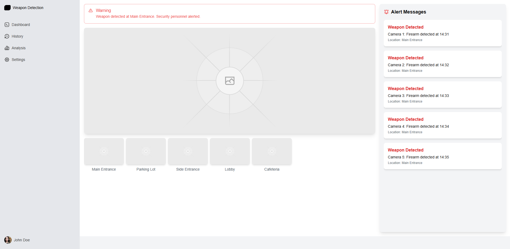
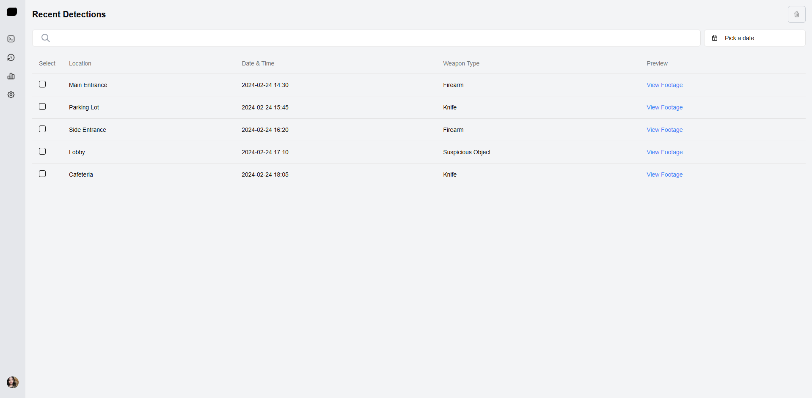
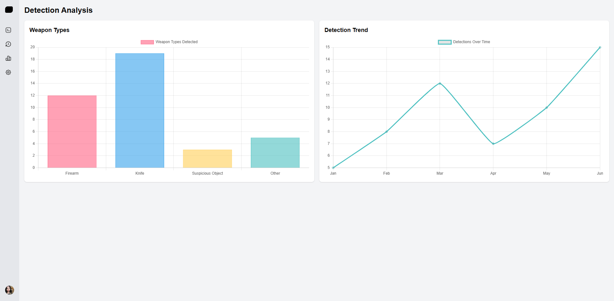
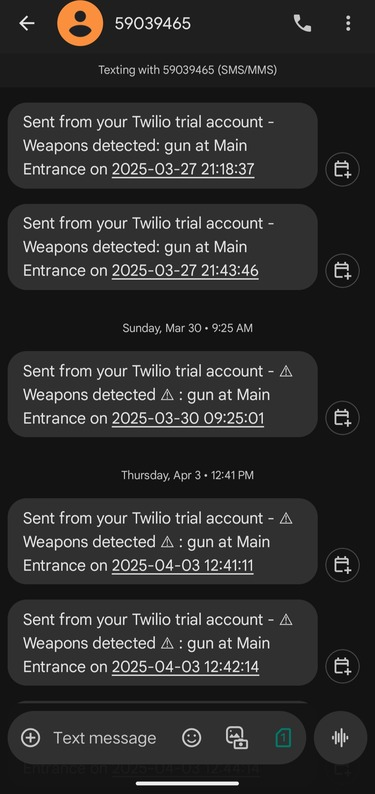

# Real-Time Weapon Detection System


A full-stack surveillance dashboard for real-time weapon detection using YOLOv8, Flask, OpenCV, Socket.IO, SQLite, and Next.js.

## What It Does

- Streams live annotated video from a webcam or sample video source
- Detects weapon classes such as `gun`, `knife`, `suspicions_object`, and `explosive`
- Stores detections in SQLite with timestamps, location, confidence, and screenshot path
- Pushes live alerts to the frontend with Socket.IO
- Shows detection history and weapon distribution analytics
- Optionally sends SMS alerts through Twilio when credentials are configured

## Project Structure

```text
backend/
  app.py
  requirements.txt
  models/my_model.pt
  screenshots/
frontend/
  app/
  components/
  lib/
package.json
README.md
```

## Quick Start

### Prerequisites

- Python 3.8+
- Node.js 18+
- npm

### 1. Install backend dependencies

```powershell
cd backend
python -m venv venv
.\venv\Scripts\activate
pip install -r requirements.txt
cd ..
```

### 2. Install frontend dependencies

The repo already includes `package-lock.json`, so install from the root:

```powershell
npm install
```

### 3. Configure the backend

Copy [backend/.env.example](backend/.env.example) to `backend/.env` and update values as needed.

Available backend variables:

- `FRONTEND_ORIGIN`
- `VIDEO_SOURCE`
- `DEFAULT_LOCATION`
- `DETECTION_CONFIDENCE`
- `ALERT_COOLDOWN_SECONDS`
- `TWILIO_ACCOUNT_SID`
- `TWILIO_AUTH_TOKEN`
- `TWILIO_PHONE_NUMBER`
- `USER_PHONE_NUMBER`

Common `VIDEO_SOURCE` values:

- `0` for the default webcam
- `guns1.mp4`
- `knives1.mp4`
- `explosive2.mp4`
- an absolute path to a local video file

Twilio is optional. If those credentials are left blank, the app will still run and will simply skip SMS sending.

### 4. Configure the frontend

Copy [frontend/.env.local.example](frontend/.env.local.example) to `frontend/.env.local` if you want to point the UI at a different backend origin.

### 5. Run the backend

From the repository root:

```powershell
npm run backend:dev
```

The backend will start on `http://localhost:5000`.

### 6. Run the frontend

In a second terminal:

```powershell
npm run frontend:dev
```

The frontend will start on `http://localhost:3000`.

## Useful Scripts

From the repository root:

```powershell
npm run backend:dev
npm run frontend:dev
npm run build:frontend
npm run lint
```

## API Endpoints

| Endpoint | Method | Description |
|---|---|---|
| `/` | `GET` | Basic service info |
| `/stream` | `GET` | Multipart JPEG video stream |
| `/screenshots/<filename>` | `GET` | Screenshot asset serving |
| `/api/history` | `GET` | Detection history |
| `/api/history/<id>` | `DELETE` | Delete a detection record |
| `/api/analysis/weapon-distribution` | `GET` | Counts grouped by weapon type |
| `/api/summary` | `GET` | Dashboard summary metrics |

## Notes

- The YOLO model file is expected at `backend/models/my_model.pt`.
- The SQLite database is created automatically under `backend/instance/database.db`.
- Sample detections will create image files under `backend/screenshots/`.
- If a sample video reaches the end, the backend rewinds it automatically.

## Verification

The current codebase has been validated with:

- `python -m py_compile backend/app.py`
- `frontend\\node_modules\\.bin\\tsc --noEmit`

In this sandbox, `next build` could not complete because worker process spawning hit an `EPERM` restriction, so that part should be re-run in a normal local shell.

## Screenshots





